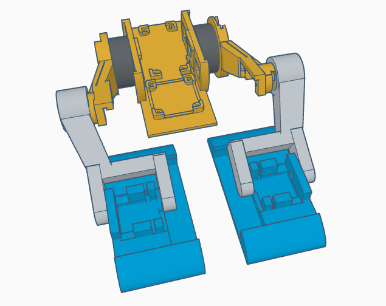

# **Betabot**

### The deep learning robot.

**What is it?** 3D printed body, Raspberry Pi 3, motor controller board, motors, sensors, battery, power boards, and a camera.

**Software:** TensorFlow, OpenCV, Python, controller board software.

**Why?** To help you test out deep learning techniques on robots.

---

### Getting started

Check out the main file: [bot.py](source/bot.py)

Check out the installer: [install](install/install)

Check out the startup help: [welcome](scripts/welcome)

Write disk image using [sd_restore](scripts/sd_restore) and pop it into a [Raspberry Pi 3](https://www.adafruit.com/product/3055).

Disk image coming soon.

### Parts
---

| Part | $US |
|--:|--:|
|[Raspberry Pi 3](https://www.adafruit.com/product/3055)| $39 |
|[XRacer 2.1](https://www.fpvmodel.com/x-racer-f303-flight-controller_g1106.html)| $18 |
|[Gimbal Motor x2](https://hobbyking.com/en_us/turnigy-hd-5208-brushless-gimbal-motor-bldc.html)| $84 |
|[BGMC x2]()| $ |
|[Charger]()| $ |
|[1.3A Lipo Battery]()| $ |
|[Pi Fisheye Cam]()| $ |
|[5V Voltage Regulator]()| $ |
|[12V Voltage Regulator]()| $ |
|[2 Transistors, 2 Resistors]()| $ |
|[Switch, Wire, Heatshrink]()| $ |
|[Filament]()| $ |
|[MicroUSB cable]()| $ |
|Total| $ |

---

### 3D body

[STL file for 3D printing](3d_models/betabot.stl)

---

### Videos

Work in progress, old body shape...

[Moving](https://www.instagram.com/p/BSNbtOvhLsf/?taken-by=tomjacobs83)

[Upright](https://twitter.com/TomPJacobs/status/848138218755170305)

[Inside](https://twitter.com/TomPJacobs/status/848136720797192192)

---

### How to build it

Looking to build it? I can help you order the parts.

Take the 3D printed case, two motors, and six screws. Make sure the small magnets are still on the back of the motors. Place one motor on the side with cable running through the hole in the case. Rotate until screw holes line up, and screw three screws in half way.

Take one motor sensor board, and slide it into position under the three screws, with chip facing towards and sitting directly under the motor magnet. Screw three screws fully in to hold the motor and board in place. Repeat with the other motor.

Take the motor controller board and place it into the mounting square in the case, plug in the microUSB. Screw it down with four screws.

Place the power board next to the controller board and screw it into place. Run the power cable into the battery compartment. 

Take the two speed controller boards and plug the motors into them. Place them down into the front area of the body.

Take the on switch and push it into position.

Place the battery into the battery compartment and plug it in. 

Take the battery charger board and slide it in over the top of the battery facing upwards with the white ports facing towards the middle. Plug the battery's charge cable into the largest white port. Screw into place with one screw. Screw two round-headed screws through the front of the body into the charge bolts.

Take the Raspberry Pi and place it on top, with USB ports facing towards the back of the case and the HDMI port facing out towards the open side. Screw down with four screws. 

Slide the back plate in. Take the top cover and place it over the top of the body. Align the screw holes and screw the long screws in to affix the top. It should open freely to ninety degrees and close completely.

Switch Betabot on. He should wake up after a minute and come to life!

