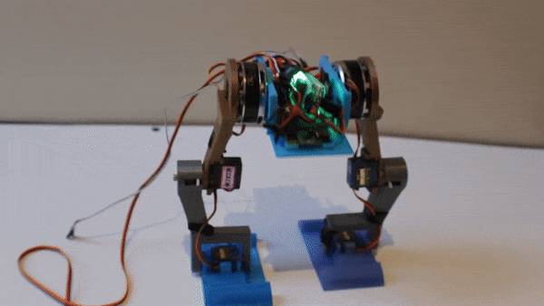
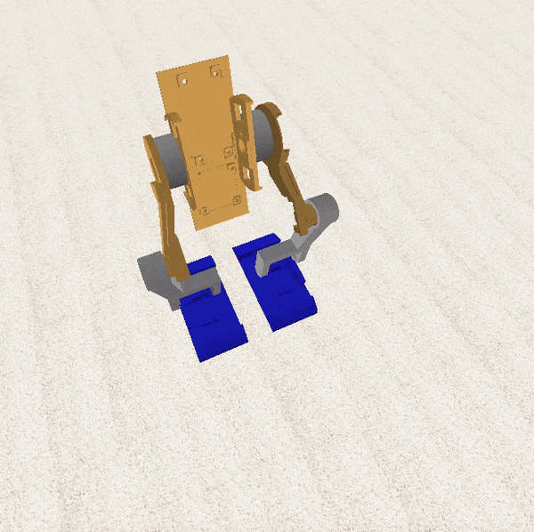
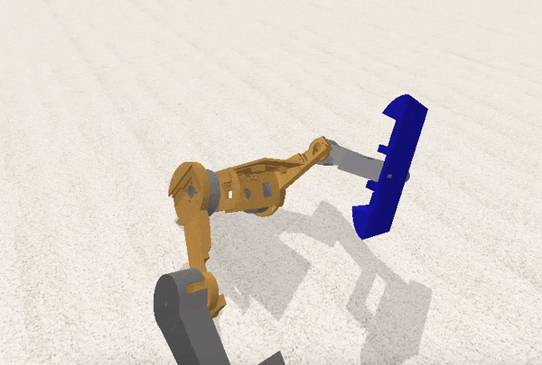

# **Betabot**

### An affordable walking biped robot, designed for deep learning research.

**What is it?**
A 3D printed body, Raspberry Pi Zero, motors & motor controllers, sensors, power boards, and a camera.

**What does it run?**
Python, PID loops, OpenCV, TensorFlow, Keras, and Betabot OS running on Raspbian.

**Why?**
To help you simulate and then quickly test out deep learning and computer vision techniques in the real world.

Read more and buy the kit [here](https://robot-overlords.myshopify.com/pages/betabot).

---
### Getting started

Check out the main file: [bot.py](source/bot.py)

Check out the installer: [install](install/install)

Check out the startup help: [welcome](scripts/welcome)

To get started, write the [disk image](coming_soon) using [sd_restore](scripts/sd_restore) and pop it into a Raspberry Pi Zero.

---

### Parts

| Part | US$ |
|--:|--:|
|[BGMC Speed Controller (x2)](http://www.rovertec.com/products-bgmc2.html)| $100 |
|[Gimbal Motor (x2)](https://www.aliexpress.com/item/Maytech-4180-130-turn-rc-brushless-gimbal-motor-in-radio-controlled-toys/1000001024913.html)| $40 |
|[Rotary Encoder (x2)](http://au.mouser.com/Search/ProductDetail.aspx?qs=Rt6VE0PE%2fOduJIB%252bRfeBZQ%3d%3d)| $40 |
|[High Torque Servos (x4)](https://hobbyking.com/en_us/turnigytm-tgy-s901d-ds-mg-robot-servo-13kg-0-14sec-58g.html)| $40 |
|[SPRacing F3 Evo](https://hobbyking.com/en_us/rjx-sp-racing-f3-evo-flight-controller.html)| $24 |
|[16GB Memory Card](https://www.adafruit.com/product/2693)| $20 |
|[1000mAh 3S Lipo Battery](https://hobbyking.com/en_us/turnigy-1000mah-3s-30c-lipo-pack.html)| $10 |
|[Pi Fisheye Cam](https://www.aliexpress.com/item/Raspberry-Pi-Zero-W-Camera-Module-Night-Vision-Wide-Angle-Fisheye-5MP-Webcam-with-Infrared-IR/32802572768.html) [(Alt)](https://www.aliexpress.com/item/Raspberry-Pi-Zero-Camera-Module-5MP-Camera-Webcam-for-Raspberry-Pi-Zero/32782501654.html)| $10 |
|[Raspberry Pi Zero W](https://www.adafruit.com/product/3400)| $10 |
|[Charger Board](https://hobbyking.com/en_us/hobbykingr-dc-4s-balance-charger-cell-checker-30w-2s-4s.html)| $9 |
|[12V/5V Voltage Regulator](https://hobbyking.com/en_us/matek-mini-power-hub-w-bec-5v-and-12v.html) [(Plug)](https://hobbyking.com/en_us/xt60-to-ec2-losi-battery-adapter-2pcs-bag.html)| $8 |
|[3D Printer Filament](https://hobbyking.com/en_us/colido-3d-printer-filament-1-75mm-pla-500g-spool-white.html)| $5 |
|[Misc: Switch, Wire, Heatshrink, Heatsink, Screws](https://www.adafruit.com/product/1478)| $5 |
|[Tiny MicroUSB OTG](https://www.adafruit.com/product/2910)| $3 |
|[Components: 2 Transistors: BDX53C & BDX54C, 2 Resistors]()| $1 | 

As you can see, the gimbals, encoders, and speed controllers are the main cost. I may replace these with large servos for the first version to keep costs down.

### **Extras**

| Part | US$ |
|--:|--:|
|[Raspberry Pi 3](https://www.adafruit.com/product/3055)| $40 |
|[12V Power Supply](https://www.adafruit.com/product/352)[Adapter](https://www.adafruit.com/product/991)| $25 |
|[Wireless Keyboard and Mouse](https://core-electronics.com.au/wireless-keyboard-and-mouse-for-raspberry-pi.html)| $20 |

You'll also need an HDMI cable and a monitor. And a soldering iron and tools.

---

### 3D body

[STL files](https://github.com/tjacobs/betabot/tree/master/ros/src/betabot_description/urdf)

---

### Videos

[Falling](https://github.com/tjacobs/betabot/blob/master/docs/fall.m4v?raw=true)

[Simulator Crawling](https://github.com/tjacobs/betabot/blob/master/docs/legs.mov?raw=true)

[More](https://github.com/tjacobs/betabot/blob/master/docs/)

---

### How it works

#### Hips

Controlled by motor outputs 1 and 2. The hips keep the bot balanced forward/backward (pitch). We read our IMU pitch value, and our PID movement controller updates the speeds of the motor outputs 1 and 2 to bring us level.

#### Knees

Controlled by motor outputs 3 and 4. Run by servos, these work with hips and feet when raising and lowering.

#### Feet

Controlled by motor outputs 5 and 6. Run by servos, these angle the feet so they don't catch when walking.

---
### Development

The Pi Zero runs the bot. It runs the main bot.py file automatically on startup (via /etc/rc.local). No heavy HDMI cables go into the bot, keeping it mobile and untethered.

The Pi Zero is listening for SSH connections via the wifi network it's on.

I use the Pi 3 on my desktop plugged into a big monitor to SSH into the Pi Zero and update code and restart scripts.

Next up: Mount the Pi Zero filesystem over the network so I can edit files directly in text editor on the desktop Pi 3. 
And after that: The Pi Zero listens to any write of the bot.py file, and every time it is written, it restarts `python bot.py`. So you can just hit save on your desktop editor, and the bot starts reacting with the new code instantly.

---
### How to build it

See parts list above.

Take the 3D printed body, two motors, and six screws. Glue the small magnets onto the back of the motor axles. Place one motor on the side of the body. Rotate until screw holes line up, and screw three screws in half way.

Take one motor sensor board, and slide it into position under the three screws, with chip facing towards and sitting directly under the motor magnet. Screw three screws fully in to hold the motor and board in place. Repeat with the other motor.

Solder the power lead, via the on switch, 5v lead, and speed controllers onto the power board. Take the power board and and place it into the mounting square on the body, and screw it down with four spacing screws

Solder the 8 motor output header pins onto the controller board. Place the controller board on top of the power board, and screw it down.

Take the two speed controller boards and plug the motors into them. Place them down into the body.

Write the Betabot [disk image](coming_soon) to the SD memory card using [sd_restore](scripts/sd_restore), and pop it into the Raspberry Pi. Take the Raspberry Pi and place it on the body, with memory card at the outer edge. Screw down with four screws. Plug in the HDMI adapter, and OTG adapter.

Screw the legs onto the motors, and place the servos into the legs and feet, and screw together. Run the leads through the legs and into the controller.

Switch Betabot on. He should wake up after a minute and come to life!
