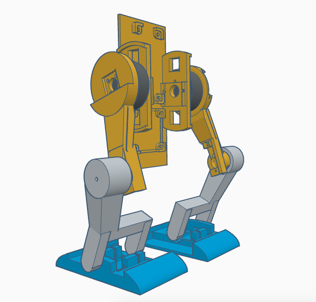
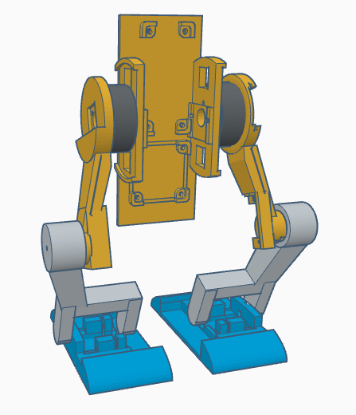
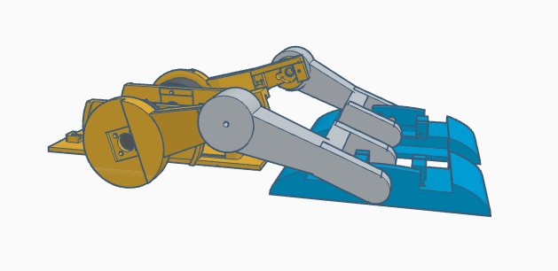

# **Betabot**

### An affordable walking biped robot, designed for deep learning research.

**What is it?**
A 3D printed body, Raspberry Pi Zero, motors & motor controllers, sensors, power boards, and a camera.

**What does it run?**
Python, PID loops, OpenCV, TensorFlow, Keras, and Betabot OS running on Raspbian.

**Why?**
To help you simulate and then quickly test out deep learning and computer vision techniques in the real world.

---
## Getting started

Check out the main file: [bot.py](source/bot.py)

Check out the installer: [install](install/install)

Check out the startup help: [welcome](scripts/welcome)

To get started, write the [disk image](coming_soon) using [sd_restore](scripts/sd_restore) and pop it into a Raspberry Pi Zero.

---

## Parts

| Part | $US | Ideal $US |
|--:|--:|--:|
|[BGMC Speed Controller (x2)](http://www.rovertec.com/products-bgmc2.html)| $100 | $20 |
|[Gimbal Motor (x2)](https://hobbyking.com/en_us/turnigy-hd-5208-brushless-gimbal-motor-bldc.html)| $84 | $60 |
|[Rotary Encoder (x2)](http://au.mouser.com/Search/ProductDetail.aspx?qs=Rt6VE0PE%2fOduJIB%252bRfeBZQ%3d%3d)| $40 | $4
|[SPRacing F3 Evo](https://www.banggood.com/F3-EVO-Cleanflight-10DOF-Flight-Controller-Oem-Version-for-Multirotor-Racing-with-4G-MicroSD-p-1064058.html)| $24 | $24
|[Filament](https://hobbyking.com/en_us/esun-3d-printer-filament-gold-1-75mm-pla-1kg-roll.html)| $20 | $5
|[1.3A Lipo Battery](https://hobbyking.com/en_us/graphene-1300mah-4s-45c-w-xt60.html)| $20 | $10
|[16GB Memory Card](https://www.adafruit.com/product/2693)| $20 | $10
|[Pi Fisheye Cam](https://www.aliexpress.com/store/product/Raspberry-Pi-wide-angle-fish-eye-camera-module-5-megapixel-160-degree-lens/1181118_32305170854.html)| $17 | $10
|[Raspberry Pi Zero W]()| $10 | $5 |
|[Charger Board](https://hobbyking.com/en_us/hobbykingr-dc-4s-balance-charger-cell-checker-30w-2s-4s.html)| $9 | $7
|[12V/5V Voltage Regulator](https://www.banggood.com/Matek-Mini-Power-Hub-Power-Distribution-Board-With-BEC-5V-And-12V-For-FPV-Multicopter-p-1005549.html)| $5 | $5
|[Switch, Wire, Heatshrink, Heatsink, Screws]()| $5 | $4
|[MicroUSB cable](https://www.adafruit.com/product/898)| $3 | $1
|[2 Transistors BDX53C, BDX54C, 2 Resistors]()| $2 | $1

As you can see, the gimbals, encoders, and speed controllers are the main cost. I may replace these with large servos for the first version to keep costs down.

### **Extras**

| Part | $US | Ideal $US |
|--:|--:|--:|
|[Raspberry Pi 3](https://www.adafruit.com/product/3055)| $35 | $35 |
|[Wireless Keyboard and Mouse](https://www.logitech.com/en-au/product/wireless-combo-mk220)| $40 | $30 |
|[12V Power Supply](https://hobbyking.com/en_us/ac-dc-adapter-12v-8a-mini-fabrikator-indiv-power-supply-big-power-8-in-1.html)| $27 | $10

You'll also need an HDMI cable and a monitor. And a soldering iron and tools.

---

## 3D body

[STL file for 3D printing](3d_models/betabot.stl)

---

## Videos

Work in progress, old body shape...

[Moving](https://www.instagram.com/p/BSNbtOvhLsf/?taken-by=tomjacobs83)

[Upright](https://twitter.com/TomPJacobs/status/848138218755170305)

[Inside](https://twitter.com/TomPJacobs/status/848136720797192192)

---

## How it works

### Hips

Controlled by motor outputs 1 and 2. The hips keep the bot balanced forward/backward (pitch). We read our IMU pitch value, and our PID movement controller updates the speeds of the motor outputs 1 and 2 to bring us level.

### Knees

Controlled by motor outputs 3 and 4. Run by servos, these work with hips and feet when raising and lowering.

### Feet

Controlled by motor outputs 5 and 6. Run by servos, these angle the feet so they don't catch when walking.

---
## Development

The Pi Zero runs the bot. It runs the main bot.py file automatically on startup (via /etc/rc.local). No heavy HDMI cables go into the bot, keeping it mobile and untethered.

The Pi Zero is listening for SSH connections via the wifi network it's on.

I use the Pi 3 on my desktop plugged into a big monitor to SSH into the Pi Zero and update code and restart scripts.

Next up: Mount the Pi Zero filesystem over the network so I can edit files directly in text editor on the desktop Pi 3. 
And after that: The Pi Zero listens to any write of the bot.py file, and every time it is written, it restarts `python bot.py`. So you can just hit save on your desktop editor, and the bot starts reacting with the new code instantly.

---
## How to build it

Looking to build it? See parts list above.

Take the 3D printed case, two motors, and six screws. Make sure the small magnets are still on the back of the motors. Place one motor on the side with cable running through the hole in the case. Rotate until screw holes line up, and screw three screws in half way.

Take one motor sensor board, and slide it into position under the three screws, with chip facing towards and sitting directly under the motor magnet. Screw three screws fully in to hold the motor and board in place. Repeat with the other motor.

Take the motor controller board and place it into the mounting square in the case, plug in the microUSB. Screw it down with four screws.

Place the power boards at the back of Betabot and screw them into place. Run the power cable into the battery compartment.

Take the two speed controller boards and plug the motors into them. Place them down into the front sides of the body.

Take the on switch and push it into position.

Place the battery into the battery compartment and plug it in. 

Take the battery charger board and slide it in over the top of the battery facing upwards with the white ports facing towards the middle. Plug the battery's charge cable into the largest white port. Screw into place with one screw. Screw two round-headed screws through the front of the body into the charge bolts.

Write the Betabot [disk image](coming_soon) to the SD memory card using [sd_restore](scripts/sd_restore), and pop it into the Raspberry Pi 3. Take the Raspberry Pi and place it on top, with USB ports facing towards the back of the case and the HDMI port facing out towards the open side. Screw down with four screws. 

Slide the back plate in. Take the top cover and place it over the top of the body. Align the screw holes and screw the long screws in to affix the top. It should open freely to ninety degrees and close completely.

Switch Betabot on. He should wake up after a minute and come to life!

